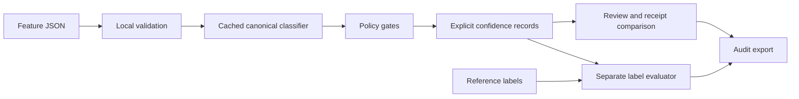

# Local workbench architecture

## Implemented

The local server serves three allowlisted static assets and four API routes.
The browser provides import, review, comparison and audit export in one working
surface. Incoming feature datasets are validated before inference. Prediction
uses a single cached canonical classifier per Python process and unchanged
numeric policy routines. Each request returns fresh records and a copied policy
mapping; no user dataset is fitted into the model.

The HTTP server is single-process/single-request-at-a-time. It binds to loopback,
validates Host and Origin, requires a session token for POST, bounds request and
batch sizes, applies a static content policy and suppresses request-content
logging. These development controls do not constitute production authentication.
The browser holds receipts in memory, and audit export is the persistence path.

The current API accepts numeric evidence features only. It cannot independently
extract reliable features from raw documents. The evaluator accepts separately
supplied labels, records their provenance declarations, and never certifies that
those declarations are true or independent.

## Optimization adopted

Reuse model initialization within a process. The uncached comparison path is
retained through predict(request, reuse_model=False), allowing reproducible
before/after checks. Benchmarking includes validation, classifier prediction,
policy application and record construction. JSON serialization is measured
separately. Model-cache startup cost still exists on each new process.

## Open design gates

| Gate | State |
|---|---|
| Numerical reference/adapter checks | Pass on shipped synthetic cases |
| Local HTTP paths and rejection cases | 10 checks pass |
| Browser visual and interaction QA | Blocked by development browser access to loopback |
| Representative user review | Not performed |
| Independent source-separated labels | Not supplied |
| Durable storage, concurrent users and identity | Not implemented |
| Load, restart, retry and rollback under hosting | Not tested |
| Google Cloud staging | Not provisioned |

Cloud hosting follows refinement; it is not needed to version or test this
prototype. Select compute, storage, region and identity after expected users,
dataset sizes and retention rules are decided. No recommendation here is a
claim about current Google Cloud pricing or a deployment already performed.
